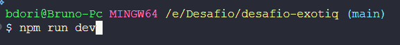
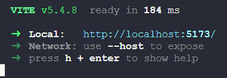
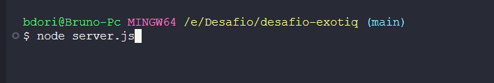
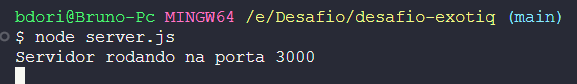

<!-- 

  

 -->

# Teste Exotiq 📝

Realizei este teste para comprovar minhas habilidades para um freeLance.

O teste consiste em criar uma landing page, consumindo a API de notícias <a href="https://newsapi.org/">News API </a>

O teste consistia em consumir a API, utilizando React, Tailwind CSS, e TypeScript.

# Como usar

Primeiro devemos baixar o repo público deste github.
Em sua máquina instale as dependecias com `npm install` e depois no mesmo terminal execute a aplicação do vite com `npm run dev`.

Para consumir API como a própria documentação descreve <a href="https://newsapi.org/docs/guides/how-to-get-the-full-content-for-a-news-article" target='_blank'>News API DOC</a>, Tive que criar um servidor com NodeJS para fazer o método de raspagem da página.

Então em outro terminal chegue na pasta raiz e execute o comando `node server.js`. Que irá executar a requisição de raspagem pelo arquivo server.js

# Tecnologias - 👨‍💻

- React
- React Router Dom
- Vite
- API (Json)
- Nodejs
- Git
